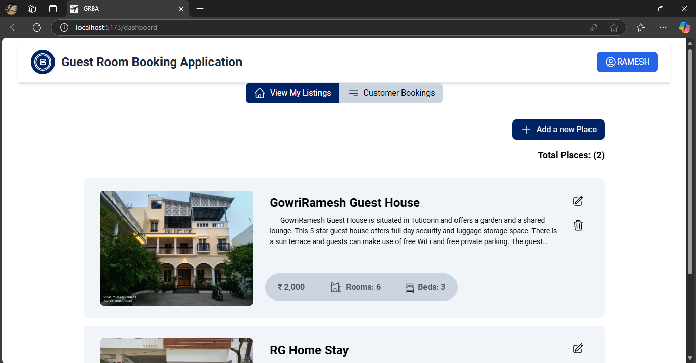
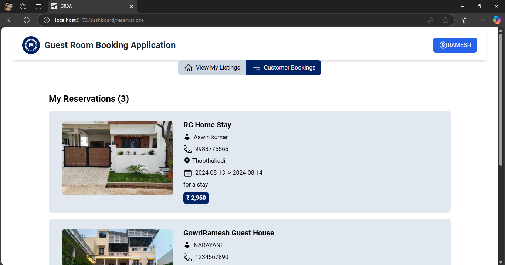

# Guest Room Booking Application

## Overview

The Guest Room Booking Application enables seamless management and booking of accommodations. House Owners can easily register and log in, manage their properties by adding or editing room details, setting booking periods, and uploading photos. They can also view all bookings for their rooms.Customers can register and log in to browse detailed room descriptions and photos, check availability using an interactive calendar, and make bookings for available dates.


### Key Features
- House owners can register, manage room details, set booking periods, and upload photos.
- Customers can browse, view room details and availability, and make bookings.

  

### Steps for Deployment

1. **Clone the repository:**
   ```sh
   git clone https://github.com/Balaatchayar/Guest_room_booking_application_MERN
  
2. **Install backend dependencies and start the server:**
    ```sh
    cd server
    npm install
    npm start

3. **Install frontend dependencies and start the vite development server**
    ```sh
    cd client
    npm install
    npm run dev

## Environment Configuration

### Server

1. Create a `.env` file in the `server` directory.

2. Add the following variables:

    ```env
    PORT=3000
    MONGOOSE_CONNECTION_URI=mongodb+srv://<username>:<password>@<host>/<database>?retryWrites=true&w=majority&appName=<appName>
    JWT_SECRET_KEY=YourSecretKey
    CLIENT_ORIGIN=http://localhost:5173
    ```

### Client

1. Create a `.env` file in the `client` directory.

2. Add the following variables:

    ```env
    VITE_BACKEND_URL=http://localhost:3000
    VITE_UPLOAD_CARE_URL=https://ucarecdn.com/
    ```

 

### Guest Room Booking Application - Screenshots

### Homepage


### Dashboard


### House Owner Features
- House Owners can Register, manage room details, set booking periods, and upload photos.
  


- View their listings
  


- View Customer Bookings
  



### Customer Features
- Customer can View room details and photos


- Check room availability with an interactive calendar
- Make bookings


- Customer can View their bookings


## Technology Stack

- **Frontend:**
  - **React.js**

- **Backend:**
  - **Node.js**
  - **Express.js**

- **Database:**
  - **MongoDB**


